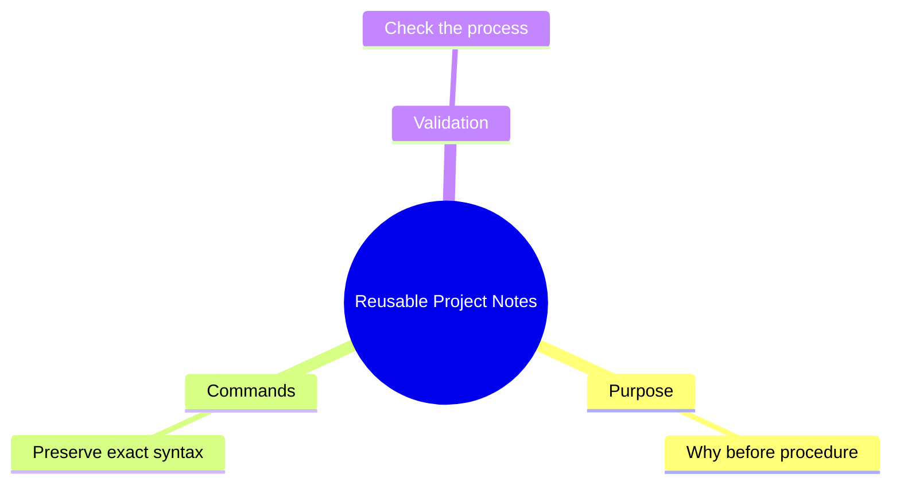

# YT-Transcription: Three Rules for Reusable Project Notes

## Visual Concept Map



## Executive Summary

**Extraction Status:** `[ENUMERATION_LOCKED: 3 items]`

**Core Thesis:** Reusable project notes work best when they preserve purpose, exact commands, and validation steps.

**Key Mechanisms:** The speaker links note quality to transferability: users need the reason, the exact executable detail, and a way to check success.

**Actionable Takeaway:** Use a Prepare / Execute / Validate / Iterate structure for reusable process notes.

**Agentic Utility:** Retrieve this note when converting procedural transcripts into repeatable checklists or runbooks.

## Deep Dive Analysis

#### Rule 1: Write Purpose Before Procedure `[Improves Context]`

**Audience Level:** Competent
**Frameworks:** Concept → Mechanism → Outcome: purpose → judgment → correct reuse

**Core Concept:** The speaker says the "why" should precede the steps.

**Mechanism:** Purpose lets future users adapt the procedure without blindly copying.

**Strategic Implication:** Process notes become reusable knowledge rather than brittle instructions.

**Practical Application:** Begin every procedure with its goal, intended audience, and decision context.

**Contrast:**
- ❌ **Anti-pattern:** Listing steps with no rationale.
- ✅ **Best Practice:** State the purpose before the procedure.

**Actionable Applications:**
- 🛡️ Prepare: Write the purpose in one sentence.
- 🔍 Recognize: A reader can explain why the procedure exists.
- 🚨 Execute: Add a "Purpose" field before steps.
- 📐 Framework: Concept → Mechanism → Outcome: explain why before how.

**Example** `[VERBATIM]`:

```text
Domain: Process documentation
Input: "write the purpose before the procedure"
Output: A rule for reusable notes.
Rationale: This is exact transcript language.
```

## Constructed Resources

#### 🛠️ Tool & Command Library

| Tool/Resource Name | Usage Context | Command/Pattern/Formula | Provenance | Framework Tags |
|---|---|---|---|---|
| Python build command | Validation command example | `python build.py --check` | `[VERBATIM]` | Debugging methodology: validation |

#### 🗣️ Prompt/Instruction Engineering

[None extracted]

## Implementation Checklist

- [ ] **Prerequisites:** Identify the procedure and audience.
- [ ] **Step 1:** Write the purpose.
- [ ] **Step 2:** Preserve exact commands.
- [ ] **Step 3:** Add validation.
- [ ] **Validation:** Confirm the note contains Prepare / Execute / Validate / Iterate.
- [ ] **Iteration:** Refine after a real user follows the note.

## Appendices

#### 📊 Appendix A: Capability Rubric

| Level | Conceptual Understanding | Practical Capability |
|---|---|---|
| **Novice** | Understands that reusable notes need purpose. | Can add a purpose statement. |
| **Competent** | Understands why exact commands matter. | Can preserve commands and validation. |
| **Proficient** | Understands adaptation and failure modes. | Can convert transcript steps into runbooks. |
| **Expert** | Understands note systems as reusable knowledge infrastructure. | Can design note schemas across teams. |

#### 📚 Appendix B: Terminology & Definitions

| Term | Definition | Context of Use | Framework Mapping |
|---|---|---|---|
| Validation | A check that confirms the procedure worked. | Rule three. | Debugging methodology: verification |

#### 🔗 Appendix C: Entities & References

**Tools/Products/Resources:**

- Python - command-line runtime shown in an example command.

**People/Organizations:**

[None extracted]

**Concepts/Ideas:**

- Prepare / Execute / Validate / Iterate - process template.

**Related Resources:**

[None extracted]

#### 🧠 Appendix D: Meta-Learning Methodology Telemetry

**Methodology Successes:**

- Explicit three-rule structure was detected.

**Methodology Gaps:**

- Transcript is short and lacks domain context.

**Recommended Process Refinements:**

- Capture timestamped examples when available.

**Recommended Follow-ups:**

- Build a reusable runbook template.

#### 🤖 Appendix E: Instruction/Prompt Index

**System/Setup Instructions:**

[None extracted]

**Task/Execution Prompts:**

- Preserve exact commands — reusable procedural note extraction — transcript rule two — technical documentation.

**Meta/Reflection Prompts:**

- Why does this procedure exist? — purpose audit — constructed from rule one — documentation design.

**Adaptation Notes:** Apply the same schema to tutorials, code walkthroughs, and operational runbooks.
