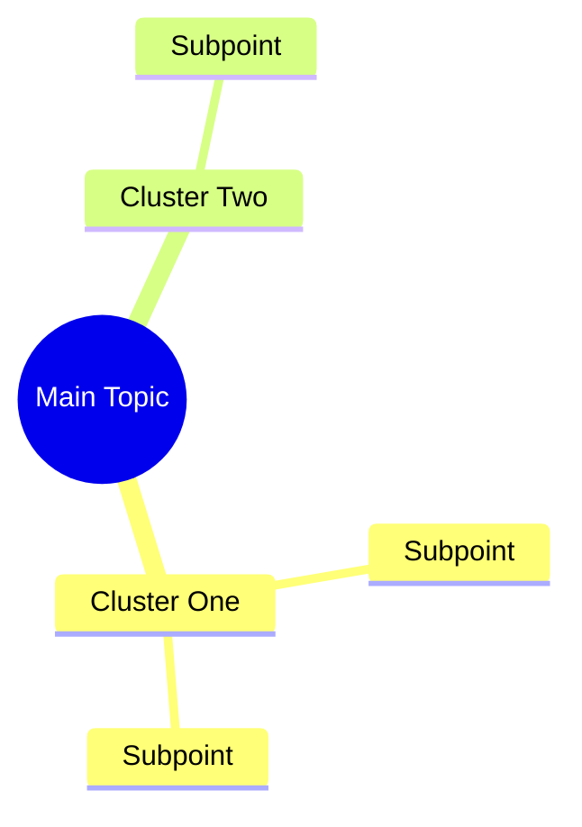

# Artifact Schema Reference

Use this file when the user asks for a complete transcript artifact or when the main `SKILL.md` output contract is not enough.

## Required order

1. YAML frontmatter
2. `# YT-Transcription: ...`
3. Visual concept map
4. Executive summary
5. Deep dive analysis
6. Constructed resources
7. Implementation checklist
8. Appendices A-E

## YAML frontmatter

The response must begin with raw YAML frontmatter. Do not put it inside a code fence.

```yaml
---
date: yyyy-mm-dd hh:mm:ss timezone
source: youtube
author: speaker-name-or-channel-or-unknown
model: model-name-if-known
length: short|medium|long
domain: technical|creative|educational|business|personal|health|entertainment|research|other
tags: [yt-transcript, knowledge-artifact, topic-tag-1, topic-tag-2]
---
```

Rules:
- Include `yt-transcript` and `knowledge-artifact`.
- Use lowercase hyphenated tags.
- If author/channel is absent, use `unknown`.
- If exact publication date is absent, use current date/time available to the model.
- Do not include non-YAML syntax in frontmatter.

## Title

The first Markdown heading after YAML must begin exactly:

```markdown
# YT-Transcription:
```

Example:

```markdown
# YT-Transcription: Practical Frameworks for Durable Maker Projects
```

## Visual concept map

Default to Mermaid mindmap:



Use `flowchart TD` for process-heavy tutorials, `graph LR` for causal systems, or a plain outline when Mermaid would be brittle.

## Executive summary

Required fields:

```markdown
## Executive Summary

**Extraction Status:** `[ENUMERATION_LOCKED: X items]` or `[DERIVED_STRUCTURE: X clusters]`

**Core Thesis:** ...

**Key Mechanisms:** ...

**Actionable Takeaway:** ...

**Agentic Utility:** ...
```

## Deep dive analysis

Each locked enumeration item or derived cluster must include:

```markdown
#### Section Title `[Benefit Tag]`

**Audience Level:** Novice|Competent|Proficient|Expert
**Frameworks:** Framework: mapping | Optional second framework: mapping

**Core Concept:** ...

**Mechanism:** ...

**Strategic Implication:** ...

**Practical Application:** ...

**Contrast:**
- ❌ **Anti-pattern:** ...
- ✅ **Best Practice:** ...

**Actionable Applications:**
- 🛡️ Prepare: ...
- 🔍 Recognize: ...
- 🚨 Execute: ...
- 📐 Framework: ...

**Example** `[VERBATIM|DESCRIBED|CONSTRUCTED|INFERRED]`:

```text
Domain: ...
Input: ...
Output: ...
Rationale: ...
```
```

## Constructed resources

Include a tool/command/resource library table. If no exact commands appear, still include tools/resources and label their provenance correctly.

```markdown
## Constructed Resources

#### 🛠️ Tool & Command Library

| Tool/Resource Name | Usage Context | Command/Pattern/Formula | Provenance | Framework Tags |
|---|---|---|---|---|
```

Then include prompt/instruction engineering entries if prompts, procedures, templates, or constructed reusable instructions are available.

## Implementation checklist

Use Markdown task checkboxes:

```markdown
## Implementation Checklist

- [ ] **Prerequisites:** ...
- [ ] **Step 1:** ...
- [ ] **Step 2:** ...
- [ ] **Step 3:** ...
- [ ] **Validation:** ...
- [ ] **Iteration:** ...
```

## Appendices

Required appendices:

```markdown
#### 📊 Appendix A: Capability Rubric
#### 📚 Appendix B: Terminology & Definitions
#### 🔗 Appendix C: Entities & References
#### 🧠 Appendix D: Meta-Learning Methodology Telemetry
#### 🤖 Appendix E: Instruction/Prompt Index
```

If a subsection has no content, write `[None extracted]`.

## Quality gate

Before producing final output, verify:
- YAML starts at character 1.
- Title prefix is exact.
- Required sections appear in order.
- Extraction Status exists.
- Every deep dive has audience level, frameworks, concepts, mechanism, strategic/practical content, contrast, actions, and example.
- Verbatim material is labeled `[VERBATIM]`.
- Synthesized material is labeled `[CONSTRUCTED]` or `[INFERRED]`.
- Empty sections use `[None extracted]`.
