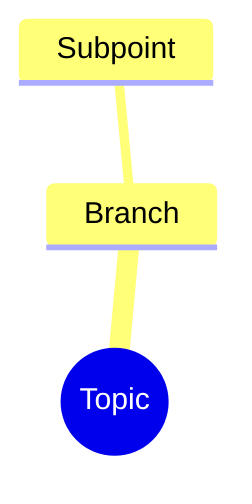

# Obsidian Formatting Reference

Use this file when producing Obsidian-ready Markdown.

## Properties / YAML

Obsidian properties are YAML frontmatter at the top of a note.

```yaml
---
title: Example Note
tags: [yt-transcript, knowledge-artifact]
aliases:
  - Example Alias
---
```

Rules:
- Keep YAML valid.
- Use lowercase hyphenated tags.
- Prefer lists for multiple tags, aliases, people, tools, or topics.
- Quote values containing colons or brackets if needed.
- Avoid complex nested objects unless necessary.

## Internal links

Use wikilinks for likely vault notes:

```markdown
[[Note Name]]
[[Note Name|Display Text]]
[[Note Name#Heading]]
[[#Heading in Same Note]]
```

Use normal Markdown links for external URLs:

```markdown
[Anthropic](https://www.anthropic.com/)
```

Do not invent vault note names unless the relationship is useful and likely to be reusable.

## Embeds

Use embeds only when relevant and when a file is likely to exist:

```markdown
![[image-name.png]]
![[note-name#heading]]
```

## Callouts

Use callouts sparingly for warnings, methodology gaps, and important extracted insights:

```markdown
> [!warning] Verification needed
> The transcript makes a time-sensitive claim. Verify before relying on it.
```

Common callout types:
- `note`
- `abstract`
- `info`
- `tip`
- `success`
- `question`
- `warning`
- `failure`
- `danger`
- `quote`

Foldable callouts:

```markdown
> [!info]- Collapsed by default
> Hidden content.
```

## Mermaid concept maps

Mindmap is the safest default for conceptual talks:



Avoid punctuation that commonly breaks diagrams. Keep node text short.

## Obsidian-oriented quality bar

A transcript artifact should be:
- Searchable by properties and headings.
- Linkable through stable section headings.
- Scannable without sacrificing detail.
- Useful for later AI retrieval.
- Free of invented metadata.
